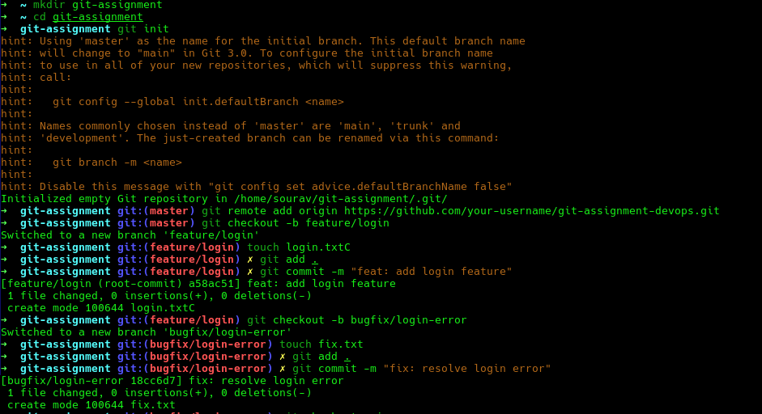
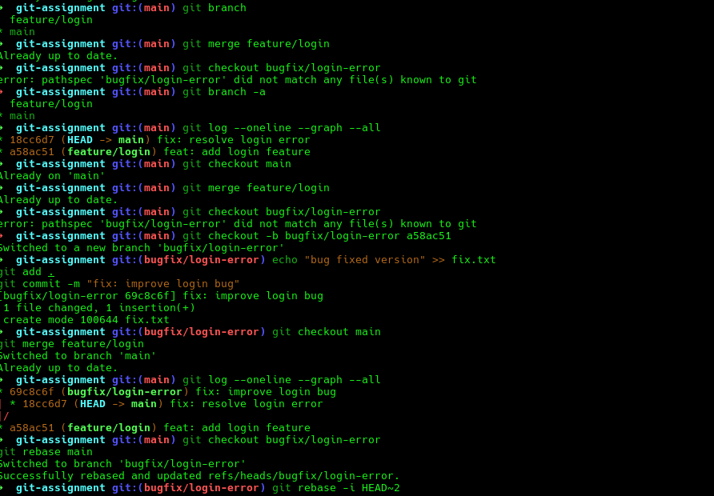
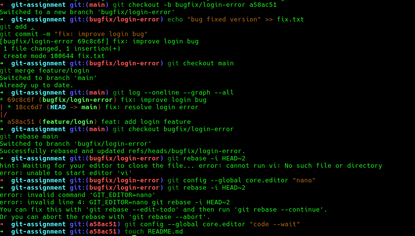

# Git Assignment

## Commands Used

```bash
git init
git status
git add .
git commit -m "initial commit"
git branch
git checkout -b feature/login
git checkout -b bugfix/login-error
git merge feature/login
git rebase main
git log --oneline
git push origin main
```

## Images

Here are the images used in this assignment:
Below are the screenshots demonstrating various Git workflows used in this assignment.

### Branch list and commits


### Merge and rebase


### Squash and Reword


